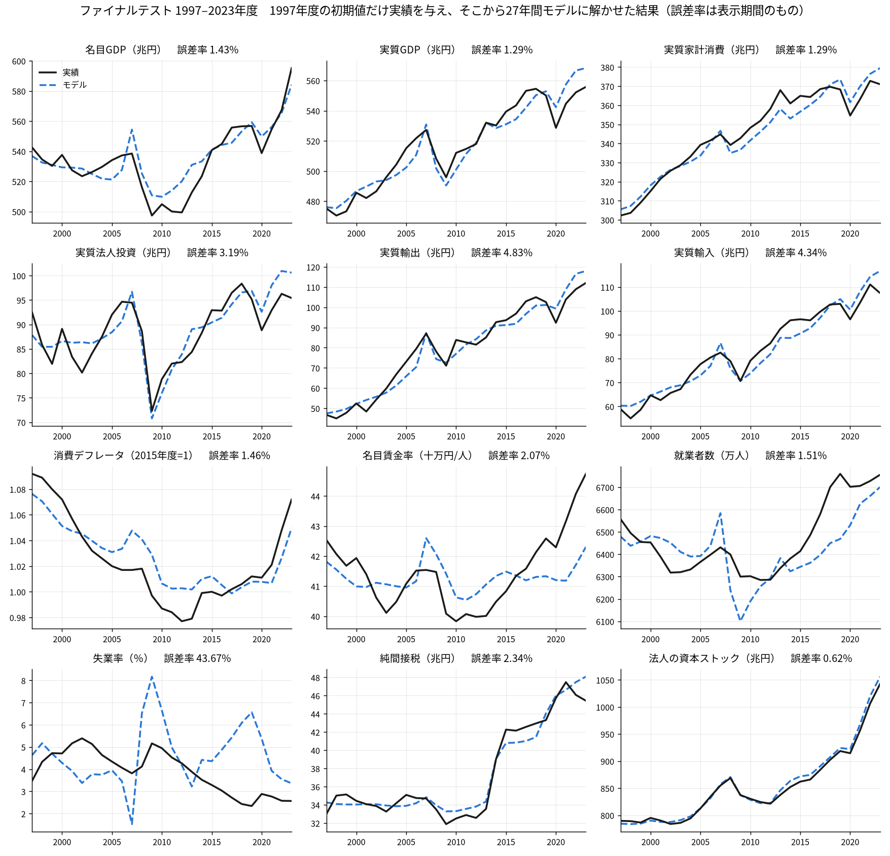
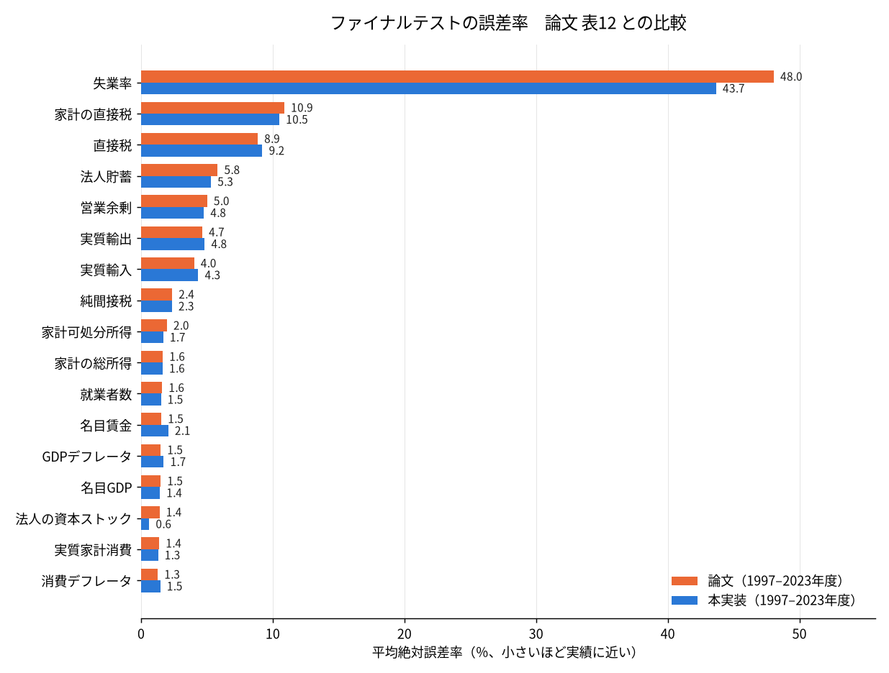

# 日本版 SFC マクロ計量モデル（朴勝俊モデルの Python 再実装）

朴勝俊（関西学院大学）が公表した日本版ストック＆フロー一貫（Stock-Flow Consistent）
マクロ計量モデルを、論文に印刷された方程式体系（169本）のまま Python で解けるように
したもの。データは内閣府「国民経済計算年次推計」ほかの公表統計から自動で組み立てる
（手入力ゼロ）。依存は numpy・pandas・matplotlib・requests・openpyxl だけ。

| 論文 | 内容 | このリポジトリでの略記 |
|---|---|---|
| 関西学院大学総合政策学部 Working Paper No. 62（2025年9月） | モデルの構築、パーシャルテスト・ファイナルテスト | 朴(2025c) |
| 同・改訂版（2026） | 本数の明記、マネーストックの定義 | 朴(2026a) |
| 関西学院大学総合政策学部 Working Paper No. 65（2026年4月） | アベノミクスの反実仮想10シナリオ | 朴(2026) WP65 |

- 内生 169本 ／ 外生 112本 ／ 1994〜2023年度（論文と同じ 2023年度国民経済計算）
- 6部門（非金融法人・日本銀行・他金融機関・一般政府・家計・海外）× 6金融資産＋金融純資産
- **式の形も本数も論文のまま。** 簡略化も上限・下限の追加もしていない
  （`python sanity_park.py` の [0] が毎回それを検査する）
- 係数は手元のデータで推定し直している（下の「論文と違うところ」）

初めて触るなら `guide.html`（モデルの考え方と手順）を先に読むとよい。反実仮想の結果を
読み解いた記事が `abenomics.html`、データセットの覚え書きが `dataset.html`。

同じソルバーとデータ層の上で Byrialsen & Raza（Levy WP No. 942）のデンマーク型モデルを
日本で動かしたものは、別リポジトリ
[sfc-japan-byrialsen-raza](https://github.com/p72/sfc-japan-byrialsen-raza) にある。

## 検証

論文が同じテストの結果を表で公表しているので、そのまま突き合わせられる。
`python park_test.py` が自動で比較する。

**パーシャルテスト**（論文 表11、1997〜2023年度）は 141 変数を比較でき、
誤差率の差の中央値は 0.50%pt。

**ファイナルテスト**（論文 表12）は 1997〜2023年度の27年間を完走する。開始年を
1997 / 2000 / 2005 / 2010 / 2015 / 2018年度のどこに置いても 2023年度まで解ける。



| 変数 | 論文 | 本実装 |
|---|---:|---:|
| 消費デフレータ | 1.27% | 1.46% |
| 就業者数 | 1.60% | **1.51%** |
| GDPデフレータ | 1.49% | 1.72% |
| 名目GDP | 1.49% | **1.43%** |
| 実質消費 | 1.38% | **1.29%** |
| 純間接税 | 2.36% | **2.34%** |
| 営業余剰 | 5.02% | **4.77%** |
| 名目賃金 | 1.54% | 2.07% |
| 実質輸出 | 4.65% | 4.83% |
| 直接税 | 8.86% | 9.21% |
| 失業率 | 48.05% | **43.67%** |

11本のうち6本は論文の値を下回り、残りも 0.6%pt 以内。失業率の誤差が両方とも
大きいのは、失業者数が労働力人口と就業者数の差として決まるため（就業者数が 1%
ずれると失業者数は 40% 以上ずれる）。



## アベノミクス反実仮想（WP65）

`python abenomics_park.py` が WP65 の10シナリオを走らせ、シナリオ10「アベノミクス
全効果」を論文の表20 と比べる。ベースラインは論文どおり **2010年度起点**、式体系は
WP65 版（朴(2025c) から5本の差し替え）。

| シナリオ10 | 論文 | 本実装 |
|---|---:|---:|
| 実質GDP 2013年度 | −3.2% | **−3.1%** |
| 実質GDP 2015年度 | −2.7% | **−2.6%** |
| 実質GDP 2018年度 | −1.7% | −2.1% |
| 実質GDP 2023年度 | −1.7% | −2.0% |
| 名目GDP 2013年度 | −4.9% | −4.4% |
| 名目GDP 2023年度 | −10.9% | −10.5% |
| 消費デフレータの差 2013年度 | −0.020 | −0.017 |
| 実質法人投資 2013年度 | −11.2% | −10.3% |
| 累計実質GDP損失 2012〜23年度 | 138.5兆円 | **140.8兆円** |

実質GDPは5年とも 0.4%pt 以内で合い、累計損失は 2% 差。表20 の 25項目の平均絶対乖離は
1.46。残る食い違いは実質家計消費で、論文はマイナス、本実装は年によってプラスに出る
（物価が下がるぶん実質可処分所得と実質純資産が増え、消費関数がそれを拾う）。

論文の範囲外の拡張として、消費税率を 2014年度以降 5% に据え置く反実仮想が
`python contax_scenario.py 5` で解ける。拡張方向のショックは失業率が低い領域に入り、
賃金式の `2.414/UNR` が急になるので、名目側の数字は割り引いて読むこと。

## 使い方

```bash
pip install -r requirements.txt

# データを組み立てる（この順番で。ESRI の Excel は cache/ に落ち、2回目以降はネットワーク不要）
python fetch_ff.py       # 資金循環（部門×金融資産）
python fetch_sector.py   # 制度部門別勘定
python fetch_misc.py     # ダミー・為替・労働力ほか
python fetch_resid.py    # 会計の調整項
python fetch_fincome.py  # 金利・配当率と利子所得
python fetch_endo.py     # 内生変数の実績値
python reestimate.py     # 推定式35本の係数（paper/*_reest.eq を生成）

# 確認と実行
python park_check.py     # 169本読めるか・外生112本そろったか
python park_test.py      # パーシャルテストとファイナルテスト（論文 表11・表12 と比較）
python abenomics_park.py # 反実仮想10シナリオ（論文 表20 と比較）
python sanity_park.py    # 方程式のドリフト検査と前向きの健全性チェック
python -m unittest test_sfcsim test_quality test_review_fixes test_fetch_ff test_fetch_misc
```

`japan_*_fy.csv` と `paper/*_reest.eq` は同梱してあるので、`fetch_*.py` と
`reestimate.py` を走らせなくても `park_check.py` から先は動く。

Python から使うとき：

```python
import parkmodel as pm
m, d = pm.load()                                   # 既定: バージョン1・再推定した係数
base = m.simulate(d, 1997, pm.last_year(), mode="dynamic")

alt = d.copy()
alt.loc[2013:, "GR"] -= 5000                       # 実質政府消費を毎年5兆円減らす（十億円）
sim = m.simulate(alt, 1997, pm.last_year(), mode="dynamic")
print(((sim["YR"] / base["YR"] - 1) * 100).loc[2015:2023].round(2))
```

`pm.load(coeffs="paper")` で論文の係数、`pm.load(wp65=True)` で WP65 版の式体系、
`pm.load(unr_floor=2.0)` で失業率の下限（感応度を見るときだけ）に切り替えられる。

## 論文と違うところ

- **係数は推定し直している。** 論文の係数は著者が組んだデータの上で推定されたもので、
  こちらのデータには移せない。式の形は論文のまま、`reestimate.py` が推定式35本の
  係数を作る。データの出典は論文と揃えてある（`dataset.html`・`paper/dataset.md`）
- **賃金式は論文の係数を出発点に微調整**したもの（動学の誤差が下がる方向への
  固定幅の座標探索）で、独立に推定したものではない。素の OLS にすると賃金は良くなり
  名目GDP・物価が悪くなるトレードオフがあり、後者を採っている
- **就業者数の式だけは論文の係数のまま。** 雇用・産出比のほぼ単位根の形をしていて、
  推定の仕方でモデル全体の性質が変わるため
- **生産関数（潜在GDP）**は論文と同じ統計（毎月勤労統計の総実労働時間指数、経済産業省の
  稼働率指数）で推定。弾力性は政府資本 0.370 / 労働 0.602 / 稼働率×資本 0.126
  （論文 0.370 / 0.593 / 0.125）
- **失業率に下限は置かない。** 論文どおり `UNR = UN/LF*100` を解く。発散はソルバーの
  都合なので、`sfcsim` が減衰を強めて解き直し、失業者数が負の解は
  `parkmodel.accept_solution` が弾く
- **既定はバージョン1（金利固定）。** 論文のスイッチはバージョン2（金利内生）の状態で
  公表されているが、極端な係数の調整式のため同時決定ブロックが 96 変数に膨らんで
  解けない。論文6章と WP65 の反実仮想はバージョン1
- **マネーストックの定義**は朴(2026a) 本文5節の `MS = NGSHA_N + NGSHA_H + NDEPA_N +
  NDEPA_G + NDEPA_H`（日銀の M3 に合わせた定義）
- **前向きシミュレーションは論文の範囲外。** `forecast.py`・`sanity_park.py` で扱えるが、
  外生112本の将来値はこちらの判断で置いたもので、著者の見解ではない

## ファイル

| ファイル | 役割 |
|---|---|
| `sfcsim.py` | ソルバー。EViews 風の方程式テキストを読み、ブロック三角化＋Gauss-Seidel／Newton で解く |
| `parkmodel.py` | 方程式体系とデータの読み込み。バージョン・係数の切替、解の受け入れ判定 |
| `reestimate.py` | 推定式35本の係数をこちらのデータで推定し直す（`paper/*_reest.eq` を生成） |
| `park_check.py` / `park_test.py` / `park_plot.py` | 本数の確認、パーシャル・ファイナルテスト、図 |
| `abenomics_park.py` / `abenomics_plot.py` / `abenomics_baseline.py` | WP65 の反実仮想10シナリオと図 |
| `abenomics_article.py` / `abenomics_template.html` | 反実仮想の記事 `abenomics.html` を解いた結果から作る |
| `contax_scenario.py` / `contax_panels.py` | 消費税率据え置きの反実仮想（論文の範囲外） |
| `park_restart.py` | 起点をずらしたときの当てはまりの変化 |
| `forecast.py` / `forecast_plot.py` / `fetch_pop.py` / `sanity_park.py` | 前向きシミュレーション（論文の範囲外）と健全性チェック |
| `fetch_ff.py` `fetch_sector.py` `fetch_misc.py` `fetch_resid.py` `fetch_fincome.py` `fetch_endo.py` | 公表統計から `japan_*_fy.csv` を作る |
| `jfont.py` | 図の日本語フォント（Linux で豆腐になるなら `fonts-noto-cjk` を入れる） |
| `guide.html` / `abenomics.html` / `dataset.html` | 解説ページ |
| `paper/` | 方程式体系の書き写しと再推定版、表11・12 の数値、データの覚え書き（`paper/README.md`） |
| `test_*.py` | ユニットテスト |

AI に開発を手伝わせるときは `AGENTS.md` を読ませること。

## 出典

- 内閣府 経済社会総合研究所「国民経済計算年次推計（2023年度確報）」金融資産・負債の
  残高／取引、制度部門別所得支出勘定・資本勘定・金融勘定、期末貸借対照表勘定、
  海外勘定、国内総生産勘定、主要系列表
- 内閣府 経済社会総合研究所「四半期別GDP速報」
- 総務省「労働力調査」長期時系列表
- 厚生労働省「毎月勤労統計調査」総実労働時間指数（30人以上）
- 経済産業省「鉱工業指数」製造工業稼働率指数（2020年基準）
- 日本銀行「実効為替レート」、FRED（米国10年国債利回り）
- IMF World Economic Outlook（世界の実質GDP成長率）
- 国立社会保障・人口問題研究所「日本の将来推計人口（令和5年推計）」（前向きの労働力人口にのみ使用）

## ライセンスと著作権

- このリポジトリのコード・データ層・覚え書きは MIT License（`LICENSE`）
- `japan_*_fy.csv` は上の公表統計（政府標準利用規約 2.0 ほか）を加工したもの。
  利用するときは出典を明記すること
- `paper/park2025c_model.eq` は朴(2025c) 巻末に印刷された方程式体系の書き写しで、
  著作権は著者にある。論文のモデルを再現するために引用の範囲で収録している。
  `paper/*_reest.eq` はそれを手元のデータで再推定した生成物。論文の PDF・本文・
  変数表・著者から配布された資料は収録しない

## 参考文献

- 朴勝俊（2025）「発展型日本版ストック＆フロー・一貫マクロ計量モデルの構築」関西学院大学総合政策学部 Working Paper No. 62, 2025年9月.
- 朴勝俊（2026）「金融資産・負債の蓄積とマネー量の変化を把握できるマクロ計量モデルの構築 ― ポストケインジアンのストック＆フロー・一貫アプローチを用いて ―」（No. 62 の改訂版）, 2026年1月.
- 朴勝俊（2026）「いわゆる『アベノミクス』がなかった場合の日本経済 ― ストック＆フロー・一貫マクロ計量モデルを用いた反実仮想分析 ―」関西学院大学総合政策学部 Working Paper No. 65, 2026年4月.
- Godley, W. and M. Lavoie (2012) *Monetary Economics*, 2nd ed., Palgrave Macmillan.
